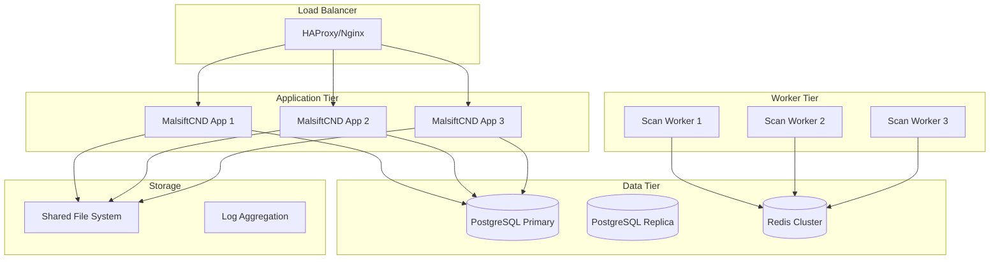

# Enterprise Deployment Guide

This guide covers deploying MalsiftCND in enterprise environments with high availability, security, and scalability requirements.

## Architecture Overview

### Production Architecture



## Deployment Options

### Option 1: Docker Swarm

**Prerequisites:**
- Docker Swarm cluster (3+ nodes)
- Shared storage (NFS/Ceph)
- Load balancer (HAProxy/Nginx)

**Deployment Steps:**

1. **Initialize Swarm:**
   ```bash
   docker swarm init --advertise-addr <MANAGER_IP>
   ```

2. **Create overlay network:**
   ```bash
   docker network create --driver overlay malsift-network
   ```

3. **Deploy stack:**
   ```bash
   docker stack deploy -c docker-compose.prod.yml malsift
   ```

### Option 2: Kubernetes

**Prerequisites:**
- Kubernetes cluster (1.20+)
- Persistent volume support
- Ingress controller

**Deployment Steps:**

1. **Create namespace:**
   ```bash
   kubectl create namespace malsift
   ```

2. **Apply configurations:**
   ```bash
   kubectl apply -f k8s/
   ```

3. **Verify deployment:**
   ```bash
   kubectl get pods -n malsift
   ```

### Option 3: Traditional Infrastructure

**Prerequisites:**
- Linux servers (Ubuntu 22.04 LTS recommended)
- PostgreSQL cluster
- Redis cluster
- Load balancer

## Infrastructure Requirements

### Minimum Production Requirements

**Application Servers:**
- **CPU**: 4 cores (8+ recommended)
- **RAM**: 8GB (16GB+ recommended)
- **Storage**: 50GB SSD
- **Network**: 1Gbps

**Database Servers:**
- **CPU**: 4 cores (8+ recommended)
- **RAM**: 16GB (32GB+ recommended)
- **Storage**: 200GB SSD with RAID
- **Network**: 10Gbps recommended

**Worker Nodes:**
- **CPU**: 8 cores (16+ recommended)
- **RAM**: 16GB (32GB+ recommended)
- **Storage**: 100GB SSD
- **Network**: 10Gbps recommended

### High Availability Setup

**Database High Availability:**
- PostgreSQL primary-replica setup
- Automated failover with Patroni
- Connection pooling with PgBouncer

**Application High Availability:**
- Multiple application instances
- Load balancer with health checks
- Session affinity not required (stateless)

**Worker High Availability:**
- Multiple worker nodes
- Automatic task distribution
- Dead letter queue for failed tasks

## Security Configuration

### Network Security

**Firewall Rules:**
```bash
# Allow HTTP/HTTPS
ufw allow 80/tcp
ufw allow 443/tcp

# Allow SSH (restrict to admin IPs)
ufw allow from <ADMIN_IP> to any port 22

# Allow database connections (internal only)
ufw allow from <APP_SUBNET> to any port 5432
ufw allow from <APP_SUBNET> to any port 6379

# Deny all other traffic
ufw default deny incoming
ufw default allow outgoing
```

**Network Segmentation:**
- DMZ for load balancers
- Application tier in private network
- Database tier in isolated network
- Worker nodes in separate network

### Application Security

**Environment Variables:**
```bash
# Use strong secrets
SECRET_KEY=$(openssl rand -base64 32)
JWT_SECRET_KEY=$(openssl rand -base64 32)

# Disable debug mode
DEBUG=false

# Use secure database credentials
DATABASE_URL=postgresql://malsift:$(openssl rand -base64 16)@db:5432/malsift
```

**SSL/TLS Configuration:**
```nginx
server {
    listen 443 ssl http2;
    server_name malsift.yourcompany.com;
    
    ssl_certificate /etc/ssl/certs/malsift.crt;
    ssl_certificate_key /etc/ssl/private/malsift.key;
    
    ssl_protocols TLSv1.2 TLSv1.3;
    ssl_ciphers ECDHE-RSA-AES256-GCM-SHA512:DHE-RSA-AES256-GCM-SHA512;
    ssl_prefer_server_ciphers off;
    
    location / {
        proxy_pass http://malsift-backend;
        proxy_set_header Host $host;
        proxy_set_header X-Real-IP $remote_addr;
        proxy_set_header X-Forwarded-For $proxy_add_x_forwarded_for;
        proxy_set_header X-Forwarded-Proto $scheme;
    }
}
```

### Database Security

**PostgreSQL Configuration:**
```postgresql
# pg_hba.conf
host    malsift    malsift    10.0.0.0/8    md5
host    malsift    malsift    172.16.0.0/12 md5
host    malsift    malsift    192.168.0.0/16 md5

# postgresql.conf
ssl = on
ssl_cert_file = 'server.crt'
ssl_key_file = 'server.key'
log_statement = 'all'
log_connections = on
log_disconnections = on
```

## Monitoring and Logging

### Application Monitoring

**Prometheus Metrics:**
```yaml
# prometheus.yml
scrape_configs:
  - job_name: 'malsift'
    static_configs:
      - targets: ['malsift-app:8000']
    metrics_path: '/metrics'
    scrape_interval: 15s
```

**Grafana Dashboards:**
- Application performance metrics
- Database performance metrics
- Scan execution metrics
- User activity metrics

### Log Aggregation

**ELK Stack Configuration:**
```yaml
# logstash.conf
input {
  beats {
    port => 5044
  }
}

filter {
  if [fields][service] == "malsift" {
    json {
      source => "message"
    }
  }
}

output {
  elasticsearch {
    hosts => ["elasticsearch:9200"]
    index => "malsift-%{+YYYY.MM.dd}"
  }
}
```

### Alerting

**Alert Rules:**
- High CPU/memory usage
- Database connection failures
- Scan failures
- Authentication failures
- SSL certificate expiration

## Backup and Recovery

### Database Backup

**Automated Backups:**
```bash
#!/bin/bash
# backup.sh
BACKUP_DIR="/backups/postgresql"
DATE=$(date +%Y%m%d_%H%M%S)

pg_dump -h localhost -U malsift malsift | gzip > "$BACKUP_DIR/malsift_$DATE.sql.gz"

# Keep only last 30 days
find $BACKUP_DIR -name "malsift_*.sql.gz" -mtime +30 -delete
```

**Recovery Process:**
```bash
# Restore from backup
gunzip -c malsift_20240101_120000.sql.gz | psql -h localhost -U malsift malsift
```

### Application Backup

**Configuration Backup:**
```bash
# Backup configuration files
tar -czf config_backup_$(date +%Y%m%d).tar.gz \
  .env \
  certs/ \
  k8s/ \
  docker-compose.prod.yml
```

## Performance Tuning

### Database Optimization

**PostgreSQL Tuning:**
```postgresql
# postgresql.conf
shared_buffers = 4GB
effective_cache_size = 12GB
maintenance_work_mem = 1GB
checkpoint_completion_target = 0.9
wal_buffers = 16MB
default_statistics_target = 100
random_page_cost = 1.1
effective_io_concurrency = 200
```

### Application Optimization

**Worker Configuration:**
```python
# celery_config.py
CELERY_WORKER_CONCURRENCY = 4
CELERY_TASK_SOFT_TIME_LIMIT = 300
CELERY_TASK_TIME_LIMIT = 600
CELERY_WORKER_PREFETCH_MULTIPLIER = 1
```

**Scan Throttling:**
```python
# Adjust based on network capacity
SCAN_THROTTLE_RATE = 500  # requests per second
MAX_CONCURRENT_SCANS = 20
```

## Disaster Recovery

### Recovery Time Objectives (RTO)
- **Critical Systems**: 4 hours
- **Non-Critical Systems**: 24 hours

### Recovery Point Objectives (RPO)
- **Database**: 1 hour
- **Configuration**: 24 hours

### DR Procedures

1. **Failover Process:**
   - Detect failure
   - Redirect traffic to DR site
   - Restore from latest backup
   - Verify functionality

2. **Failback Process:**
   - Sync data from DR to primary
   - Redirect traffic to primary
   - Verify functionality
   - Update monitoring

## Compliance and Auditing

### Audit Logging

**Enable comprehensive logging:**
```python
# logging.conf
[loggers]
keys=root,malsift,audit

[handlers]
keys=console,file,audit_file

[formatters]
keys=standard,audit

[logger_audit]
level=INFO
handlers=audit_file
qualname=audit
propagate=0

[handler_audit_file]
class=FileHandler
level=INFO
formatter=audit
args=('/var/log/malsift/audit.log',)
```

### Compliance Requirements

**SOX Compliance:**
- User access controls
- Audit trail maintenance
- Data integrity verification

**GDPR Compliance:**
- Data encryption at rest
- Data retention policies
- Right to be forgotten

**PCI DSS Compliance:**
- Network segmentation
- Access controls
- Regular security testing

## Support and Maintenance

### Maintenance Windows

**Scheduled Maintenance:**
- Weekly: Security updates
- Monthly: Database maintenance
- Quarterly: Full system review

### Support Contacts

**Internal Support:**
- Primary: security-team@yourcompany.com
- Secondary: infrastructure-team@yourcompany.com

**External Support:**
- Malsift Support: support@malsift.com
- Emergency: +1-XXX-XXX-XXXX

### Escalation Procedures

1. **Level 1**: Internal team (4 hours)
2. **Level 2**: Malsift support (2 hours)
3. **Level 3**: Malsift engineering (1 hour)
