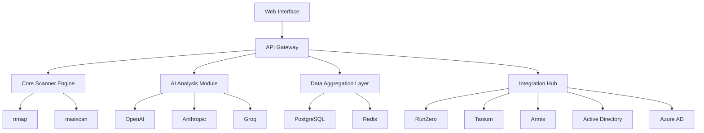

# MalsiftCND Documentation

Welcome to the MalsiftCND documentation! MalsiftCND is an enterprise-grade attack surface discovery tool designed to provide comprehensive network visibility and device identification.

## What is MalsiftCND?

MalsiftCND combines traditional network scanning tools with AI-powered analysis to deliver accurate device identification and comprehensive network visibility. It's designed for security professionals and network administrators who need to understand their attack surface.

## Key Features

- **Multi-Scanner Integration**: Leverages proven scanning tools like nmap and masscan
- **AI-Powered Analysis**: Integrates with LLM APIs for enhanced device identification
- **Enterprise Integrations**: Connects with RunZero, Tanium, Armis, and Active Directory/Azure AD
- **Secure Authentication**: Supports local users, AD, and Azure AD with optional MFA
- **SSL/TLS Support**: LetEncrypt and enterprise certificate support
- **REST API**: Full API for automation tool integration
- **Admin Interface**: Comprehensive configuration and throttling controls

## Quick Links

- [Installation Guide](installation.md) - Get MalsiftCND up and running
- [Quick Start](quickstart.md) - Start scanning your network in minutes
- [Enterprise Deployment](enterprise-deployment.md) - Deploy in enterprise environments
- [API Reference](api-reference.md) - Integrate with your tools
- [Admin Manual](admin-manual.md) - Configure and manage the system

## Architecture Overview

MalsiftCND consists of several key components:

## Getting Started

1. **Install MalsiftCND** - Follow our [installation guide](installation.md)
2. **Configure Authentication** - Set up local users or integrate with AD/Azure AD
3. **Configure Integrations** - Connect to your existing security tools
4. **Start Scanning** - Begin discovering devices on your network
5. **Review Results** - Analyze discovered devices with AI-powered insights

## Support

For enterprise support and questions:
- Email: support@malsift.com
- Documentation: This site
- GitHub Issues: For bug reports and feature requests

## License

MalsiftCND is licensed under the MIT License. See the LICENSE file for details.
